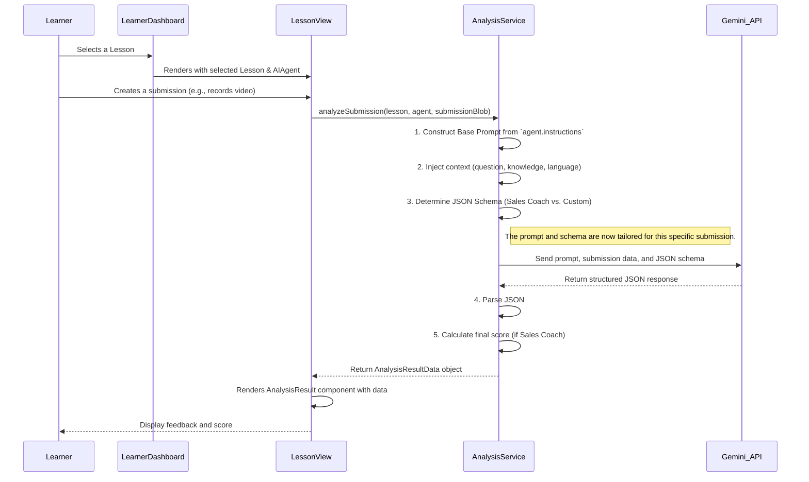

# AI Coach - AI Agents Architectural Overview

This document describes the architecture of the AI Agent system within the AI Coach application. The system is designed to be modular and flexible, allowing administrators to create custom AI evaluators for a wide range of lesson types and submission formats.

## 1. Core Principles

The architecture is built on the following key principles:

-   **Modularity**: AI Agents are self-contained entities. They can be created and assigned to lessons without altering the core application logic.
-   **Flexibility**: The system supports various submission types (video, audio, image, document, text) and custom evaluation criteria through dynamic prompt engineering.
-   **Data-Driven UI**: The user interface adapts based on the properties of the selected `AIAgent` and `Lesson`, such as conditionally displaying scoring weightages only for the default Sales Coach.
-   **Separation of Concerns**: The UI for agent/lesson creation, the backend analysis logic, and the data models are distinctly separated, making the system easier to maintain and extend.

## 2. System Components

The AI Agent system consists of several interconnected components:

| Component                    | Location                       | Responsibility                                                                                                                                                                                                            |
| ---------------------------- | ------------------------------ | ------------------------------------------------------------------------------------------------------------------------------------------------------------------------------------------------------------------------- |
| **AI Agent Data Model**      | `types.ts`                     | Defines the structure of an agent (`AIAgent` interface), including its `id`, `title`, and `instructions`. A special boolean flag, `isSalesCoach`, identifies the default agent with unique scoring logic.            |
| **Agent Creator UI**         | `components/AdminDashboard.tsx`  | Provides a form for administrators to create new `AIAgent` instances by defining a `title` and providing the core `instructions` (the system prompt).                                                                      |
| **Lesson Configuration**     | `components/AdminDashboard.tsx`  | During lesson creation, an admin assigns a specific `AIAgent` to a `Lesson` via a dropdown menu. This links the lesson to its evaluator. The `Lesson` object stores the `agentId`.                                      |
| **Submission Handler UI**    | `components/LessonView.tsx`      | Dynamically renders the appropriate submission interface (e.g., camera recorder, file uploader, text area) based on the `lesson.submissionType`. It captures the user's submission (as a `Blob`) for analysis.              |
| **Analysis Service**         | `services/geminiService.ts`      | The core logic engine. The `analyzeSubmission` function orchestrates the entire evaluation process.                                                                                                                      |
| **Feedback Display UI**      | `components/AnalysisResult.tsx`  | Displays the final analysis to the learner. It dynamically shows a detailed scoring chart for the `Sales Pitch Coach` or only qualitative feedback for custom agents.                                                   |
| **AI Model (External)**      | `Google Gemini API`            | The external large language model that processes the final prompt and submission data, performing the actual analysis and returning a structured JSON response.                                                         |

## 3. Data Flow & Logic

The evaluation process follows a clear, sequential data flow from user interaction to the final feedback display.

### Key Logic within `AnalysisService`:

1.  **Dynamic Prompt Construction**: The service starts with the `agent.instructions` as a base. It then dynamically injects the specific `lesson.question`, any `internal knowledge` (documents/text), and a strict command to *only* use that knowledge if the lesson is `internal`. This creates a highly specific, context-aware prompt for the AI.

2.  **Dynamic JSON Schema Generation**: The service's most critical feature is its ability to request a specific output format from the AI.
    -   If `agent.isSalesCoach` is `true`, it constructs a detailed JSON schema requiring `scores` (for tone, content, approach) and an array of `feedback`.
    -   For any other custom agent, it uses a simpler schema that only requires an array of `feedback`.

This dynamic schema is the key to the system's flexibility. It allows the default Sales Coach to provide quantitative scores while custom agents can provide purely qualitative, instruction-based feedback without causing errors.
